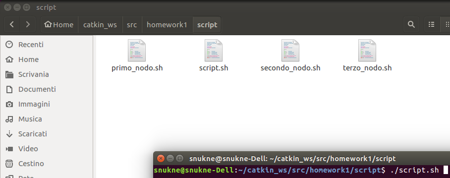
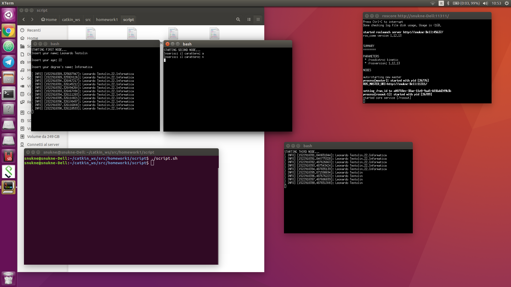
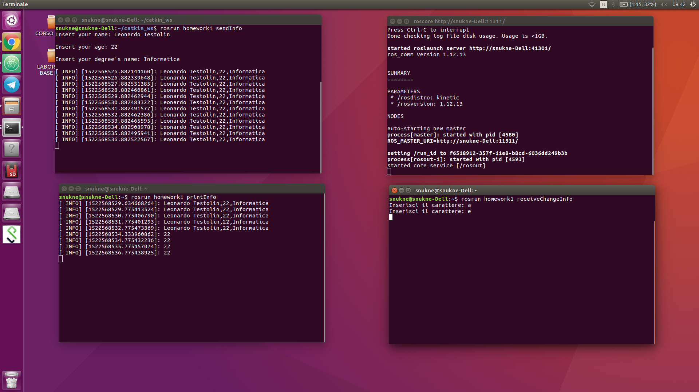

# HOMEWORK_1 ROS communication based example

This file is part of homework and it is distributed under the terms of the
GNU Lesser General Public License (Lesser GPL)

Homework1 è un esercizio per casa in cui tre nodi comunicano tra loro attraverso il sistema operativo ROS 
<html>
  <head>
  </head>
  <body>
    <ul>
      <li>
      Il primo nodo richiede il nome, età, corso Informatica.
      </li>
      <li>
      Il secondo nodo richiede di inserire:  
                                            'a' per visualizzare tutto il messaggio (nome,età,cdl)  
                                            'n' per visualizzare solo il nome  
                                            'e' per visualizzare solo l'età  
                                            'c' per visualizzare solo la cdl  
      Il 2° nodo richiederà di inserire la vostra scelta ogni 5 secondi (scelta costruttiva)
      senza però dover premere invio, ma solo digitando il carattere e nel caso in cui venisse
      premuto un tasto diverso da quelli elencati sopra
      il 2° nodo si chiuderebbe.
      </li>
      <li>
      Il terzo nodo mostrerà ciò che nel secondo nodo è stato selezionato.  
      </li>
    </ul>
    <h2> Come eseguire il programma ROS </h2>
    Il programma può essere eseguito nel modo in cui segue:
    <ul>
      <li>
      Aprire il terminale all'interno della cartella script.
      </li>
      <li>
      Scrivere nel terminale: ./script.sh si apriranno altre 3 bash (xterminal).
      In questi 3 terminali ci saranno: 1° nodo, 2°nodo e 3° nodo.
      </li>
    </ul>
    <h2> Ulteriore metodo per eseguire il programma </h2>
    <ul>
      <li>
        Aprire il terminale e digitare roscore
      </li>
      <li>
        Aprire il terminale e posizionarsi in catkin_ws e digitare il comando rosrun homework1 sendInfo  
      </li>
      <li>
        Aprire un ulteriore terminale e posizionarsi in catkin_ws e digitare il comando rosrun homework1 receiveChangeInfo
      </li>
      <li>
        Aprire un ulteriore terminale e posizionarsi in catkin_ws e digitare il comando rosrun homework1 printInfo
      </li>
    </ul>
    <h3> Illustrazione sull'esecuzione del programma <b>senza</b> script </h3>
  </body>
</html>

<b>Nodo master:</b>  
  
<b>Nodo 1:</b>  
  
<b>Nodo 2:</b>  
  
<b>Nodo 3:</b>  
  

<html>
  <head> </head>
  <body>
    <h3> Illustrazione esecuzione programma <b>con</b> script </h3>
  </body>
</html>

<b>Lancio script: </b>  
  
<b>Esecuzione script con nodi: </b>  
  

La struttura dell'esercizio può essere sintetizzata nell'immagine seguente: 
<b>Nodes Graph:</b>  
  

<b>Esecuzione programma senza l'uso dello script: </b> 

Please, report suggestions/comments/bugs to 
snukne96@gmail.com
