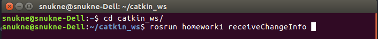
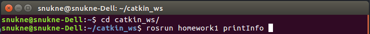
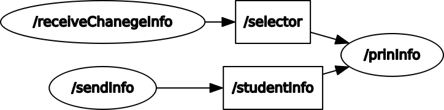

# HOMEWORK_1 ROS communication based example

Homework1 è un esercizio per casa in cui tre nodi comunicano tra loro attraverso il sistema operativo ROS 
<html>
  <head>
  </head>
  <body>
    <ul>
      <li>
      Il primo nodo richiede il nome, età, corso di laurea. Una volta inserito tutto ciò le invierà terzo nodo.
      </li>
      <li>
      Il secondo nodo richiede di inserire:  
                                            'a' per visualizzare tutto il messaggio (nome,età,cdl)  
                                            'n' per visualizzare solo il nome  
                                            'e' per visualizzare solo l'età  
                                            'c' per visualizzare solo la cdl  
                                            'q' per uscire dal programma  
      Il carattere sarà inviato al terzo nodo. Se il carattere inserito non è tra quelli a scelta verrà segnalato un errore.
      </li>
      <li>
      Il terzo nodo mostrerà di default tutto il messaggio e nel caso l'utente inserisca una scelta verrà mostrato solo la parte del messaggio richiesta.  
      </li>
    </ul>
    <h2> Come eseguire il programma ROS </h2>
    Il programma può essere eseguito nel seguente modo:
    <ul>
      <li>
      Aprire il terminale all'interno della cartella script.
      </li>
      <li>
      Scrivere nel terminale:
      <pre> $ ./script.sh </pre>  
      Si apriranno altre 3 bash.  
      In questi 3 terminali ci saranno: 1° nodo, 2°nodo e 3° nodo.  
      </li>
    </ul>
    <h2> Ulteriore metodo per eseguire il programma </h2>
    <blockquote>
    <ul>
      <li>
        Aprire il terminale e digitare il comando:  
        <pre>$ roscore </pre>  
      </li>
      <li>
        Aprire il terminale e digitare il comando:  
        <pre>$ rosrun homework1 sendInfo </pre>  
      </li>
      <li>
        Aprire un ulteriore terminale e digitare il comando:  
        <pre>$ rosrun homework1 receiveChangeInfo </pre>  
      </li>
      <li>
        Aprire un ulteriore terminale e digitare il comando:  
        <pre>$ rosrun homework1 printInfo </pre>  
      </li>
    </ul>
    </blockquote>
    <h3> Illustrazione sull'esecuzione del programma <b>senza</b> script </h3>
  </body>
</html>

<!-- CAMBIARE SOLO IMMAGINE DEL SENDINFO -->
<b>Nodo master:</b>  
  
<b>Nodo 1:</b>  
  
<b>Nodo 2:</b>  
  
<b>Nodo 3:</b>  
  

<html>
  <head> </head>
  <body>
    <h3> Illustrazione esecuzione programma <b>con</b> script </h3>
  </body>
</html>

 <!-- DA MODIFICARE LE IMMAGINI -->
<b>Lancio script: </b>  
  

<!-- CAMBIARE IMMAGINE NODI -->
La struttura dell'esercizio può essere sintetizzata nell'immagine seguente: 
<b>Nodes Graph:</b>  
  
<b>Nodes Graph with all components: </b>
  

<html>
  <head> </head>
  <body>
    <h3> Illustrazione esecuzione programma con <b>roslaunch</b> </h3>
    <blockquote>
    

    Aprire il terminale e posizionarsi sulla cartella catkin_ws.  
    Digitare:
    <pre>$ roslaunch homework1 info.launch </pre>
    Ciò che apparirà saranno i tre terminali con cui si interagisce con il programma
    

    </blockquote>
  </body>
</html>

<b>Esecuzione programma con roslaunch: </b>  
  

<b>Esecuzione programma con roslaunch, modalità classica oppure script: </b> 

Please, report suggestions/comments/bugs to 
snukne96@gmail.com
